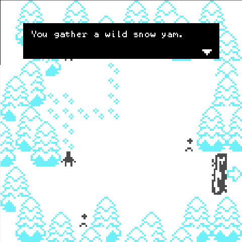

This project created in [itch.io - 2022 Low Code Game Jam (GNOJ#7)](https://itch.io/jam/games-now-online-jam-7/rate/1802644) for the theme `Winter`

## Winter farm festival

A [Bitsy](https://make.bitsy.org/) game. Enjoy your time in the winter farm. 

More details can be found in the [online playing page](https://hundun.itch.io/winter-farm-festival).

### play locally

The `html` file in `/output`.

Controls guide:

direction keys: move

space: continue dialog, confirm choice

z: use the hoe (after you own it)

### dev

Load bitsy hacks by [bitsy-boilerplate](https://github.com/seleb/bitsy-boilerplate). Use `/dev/bitsy-boilerplate-project`.